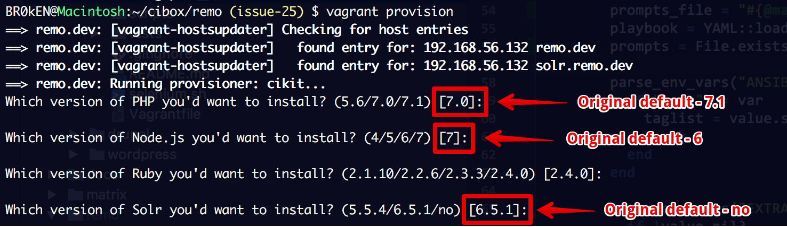

- Solr `5.5.4` and `6.5.1` available for choosing!
- Jenkins `2.57`.
- Smart InnoDB configuration: `innodb_buffer_pool_size` - percentage of total available RAM and value of `innodb_log_file_size` - is a percent of computed value of `innodb_buffer_pool_size`.
- Caching the answers during VM provisioning.

## Reference

[https://github.com/BR0kEN-/cikit/pull/27](https://github.com/BR0kEN-/cikit/pull/27)
