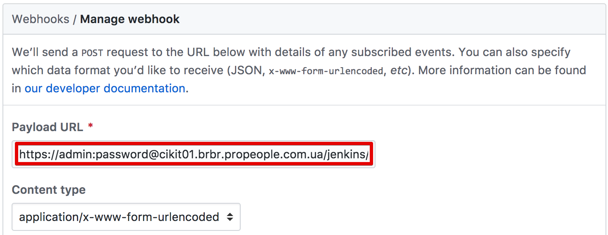

Github credentials configuration is simpler than ever before! Update three values: username, API token, SSH key and your jobs are good to go!

Also, new nice improvement will automatically create a hook in Github repository with correct HTTP auth credentials.

## Reference

[Configure Github bot](../../_documentation/jenkins/github-bot)
