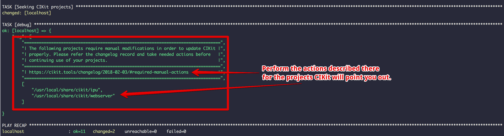

The ability to choose `nginx` or `apache2` as a web server for a project has been introduced! Refer the documentation to get acquainted with the configuration and technical aspects.

## Required manual actions

Right after updating the package via `cikit self-update` please make sure all the projects you have based on CIKit will receive the following modifications:

*The message will be shown after fetching the updates.*
{: .notice--warning}

- Open the `/path/to/project/.cikit/vars/ports.yml` and replace the following:
  - `apache_port_ssl` by `web_port_ssl`
  - `apache_port` by `web_port`
- Remove the `/path/to/project/.cikit/vars/apache.yml`.
- Create the [/path/to/project/.cikit/vars/web-server.yml](https://github.com/BR0kEN-/cikit/blob/master/cmf/all/.cikit/vars/web-server.yml) (the contents is by the link).
- Login to every existing VM via `vagrant ssh` and run `sudo ln -fs /usr/local/share/cikit/lib/cikit /usr/bin/cikit` or run `vagrant provision` instead (if you want to).

## References

- [https://github.com/BR0kEN-/cikit/issues/49](https://github.com/BR0kEN-/cikit/issues/49)
- [Tests that were run for checking the operability](https://github.com/BR0kEN-/cikit/pull/90#issuecomment-361190266)

## Documentation

- [Choose and configure a web server for a project](/documentation/project/web-server/)
