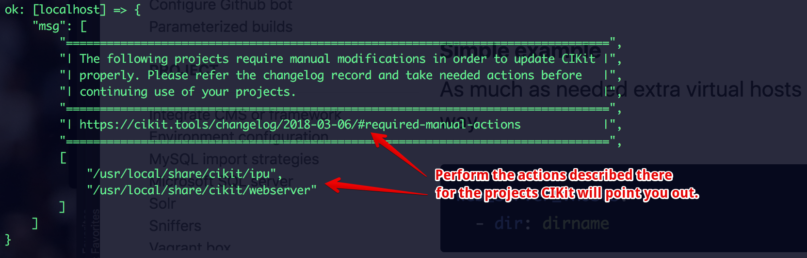

- Simplified a procedure of defining virtual hosts.
- Added reflection of defined virtual hosts in `/etc/hosts` for local environments.
- Added an ability to define application subdomains that work both on CI droplet and locally.

## Required manual actions

Right after updating the package via `cikit self-update` please make sure all the projects you have based on CIKit will receive the following modifications:

*The message will be shown after fetching the updates.*
{: .notice--warning}

- Make sure that your `/path/to/project/.cikit/vars/web-server.yml` has the same structure as an original [web-server.yml](https://github.com/BR0kEN-/cikit/blob/master/cmf/all/.cikit/vars/web-server.yml).

## References

- [https://github.com/BR0kEN-/cikit/issues/99](https://github.com/BR0kEN-/cikit/issues/99)

## Documentation

- [Custom virtual hosts](/documentation/project/custom-vhosts/)
