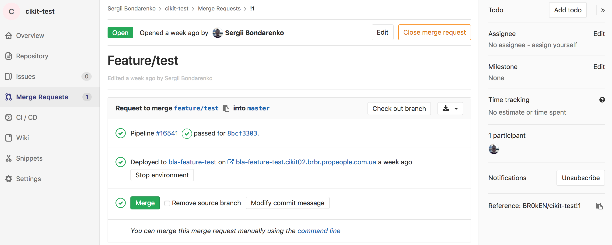
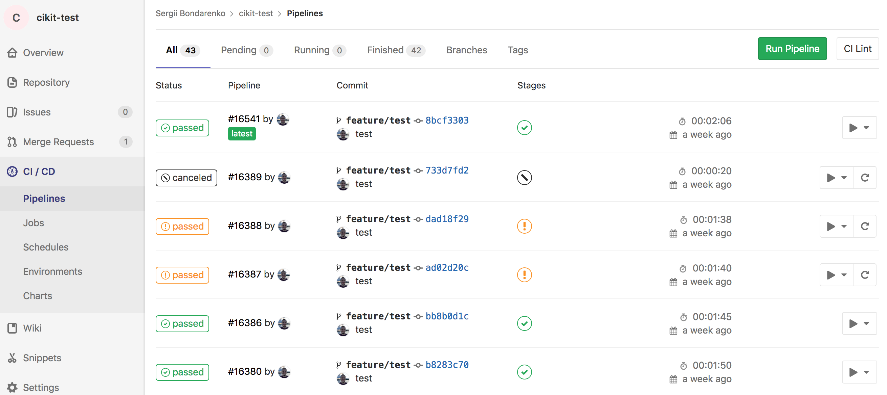
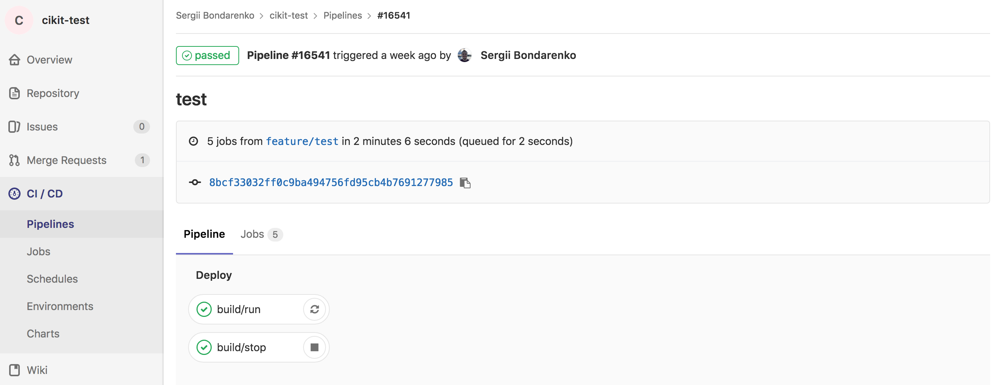
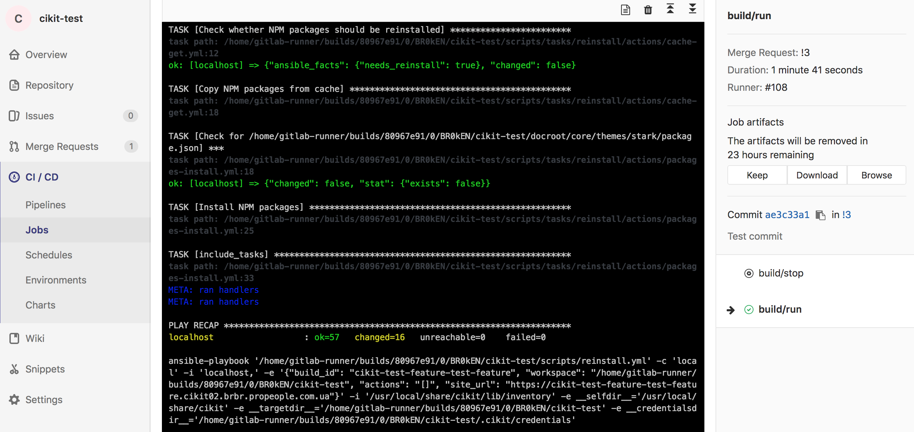
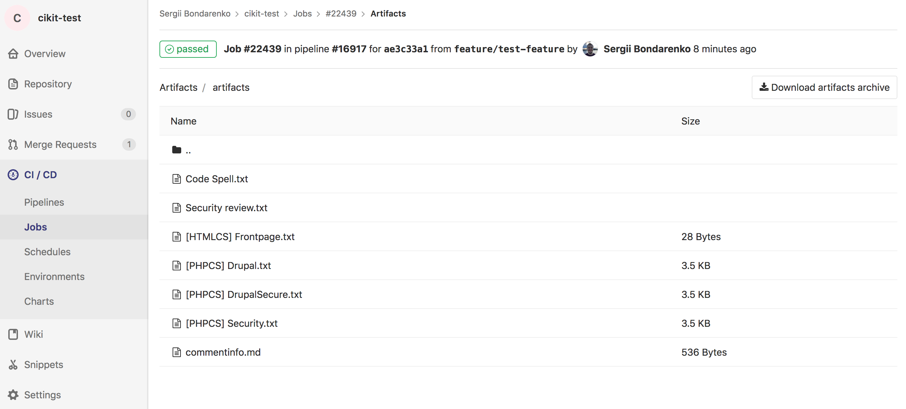

It is possible to use Gitlab CI instead of Jenkins for continuous builds of projects. There are several differences between these two solutions and we'll review them superficially.

**Jenkins**: fully pluggable system, allowing to create a flexible architecture for your continuous integration. More complex and require some maintenance.

**Gitlab CI**: has no UI in comparison to Jenkins, cannot build pull requests (merge requests), don't have a plugin ecosystem. Simple and inflexible. Can continuously build projects only on `git push` event for specified branches.

It's also worth saying that Jenkins (in CIKit) don't have an integration with Gitlab and, of course, Gitlab CI cannot build projects hosted on Github.

## Installation

Let's say you decided to use Gitlab CI instead of Jenkins and ready to provision a CI server. To do so two additional options have to be added to the `cikit provision` command.

```bash
cikit provision \
  --limit=HOSTNAME \
  --gitlab-ci-token=TOKEN \
  --gitlab-ci-url=https://gitlab.com
```

The `https://gitlab.com` is the default value for `--gitlab-ci-url` option, therefore, can be omitted.
{: .notice--info}

The `TOKEN` can be obtained in the project's settings on Gitlab, see [https://docs.gitlab.com/ce/ci/runners/#registering-a-specific-runner-with-a-project-registration-token](https://docs.gitlab.com/ce/ci/runners/#registering-a-specific-runner-with-a-project-registration-token).
{: .notice--info}

The above command will configure the [Gitlab Runner](https://docs.gitlab.com/runner) on a CI droplet and create the `.gitlab-ci.yml` in the root directory of your project. Commit and push that file to finish an integration.

## Configuration

The created `.gitlab-ci.yml` is a working example that covers common cases but you can modify it by desire. Follow the [official documentation](https://docs.gitlab.com/ee/ci/yaml).

To [skip the build](https://docs.gitlab.com/ee/ci/yaml/#validate-the-gitlab-ci-yml), add `[ci skip]` or `[skip ci]` to the message of a commit.
{: .notice--info}

## Screenshots

### Merge request



### Pipelines



### Pipeline



### Build



### Artifacts



Using Gitlab CI, unfortunately, we're not able to get a fast overview of the artifacts (reports). We have to go to the pipeline from merge request, then to a job and click `Browse` button in the sidebar. And even after these actions, it seems enough to just open the files directly in a browser to overview their contents, but not, Gitlab requires to download them.
{: .notice--warning}
