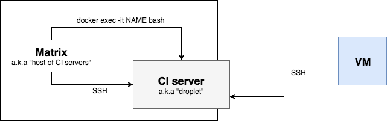

The structure of components that CIKit manages is shown on the scheme below.



The CI server (droplet) could be located as on the other server (matrix), as being the highest unit in a chain.

## Access droplet from Matrix

When a droplet is located within Matrix then it can be accessed in two ways: [via Docker](../../matrix/droplet-ssh/#docker) from the Matrix or [via SSH](../../matrix/droplet-ssh/#ssh) from the outside.

## Access droplet from VM

Define the host via [hosts manager](../README.md) or use an existing one in Ansible's `delegate_to`.

### Example

Define the host.

```bash
cikit host/add --alias=matrix1 --domain=server.example.com
```

Use the alias.

```yaml
- name: Test task
  copy:
    dest: /tmp/test.txt
    force: yes
    content: "Test content"
  delegate_to: matrix1
```

If you're in the project directory and having the `.cikit/credentials/MATRIX_NAME/DROPLET_NAME` catalogs structure then the `MATRIX_NAME.DROPLET_NAME` alias can be used as well/instead.
{: .notice--info}
