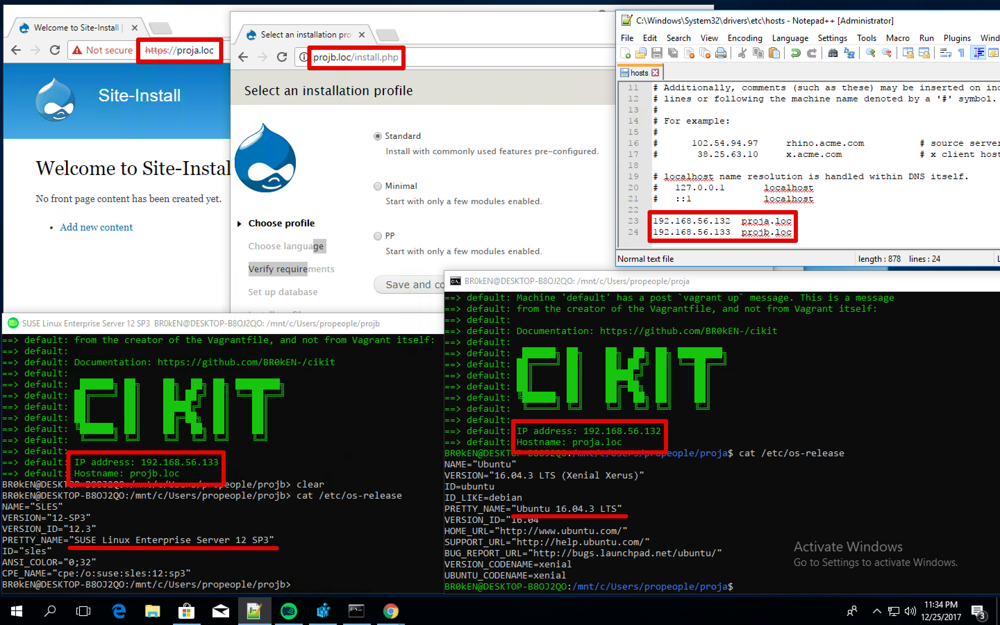

You must have the `16215` OS build or greater to continue (run `ver` in `cmd.exe` to check).

## Install VirtualBox

Download VirtualBox at [https://www.virtualbox.org/wiki/Downloads](https://www.virtualbox.org/wiki/Downloads) and install it as a regular Windows program.

Installation of Guest Additions is not needed.

## Enable and install WSL

Start PowerShell in privileged mode and run the next command. Reboot OS afterward.

```powershell
Enable-WindowsOptionalFeature -Online -FeatureName Microsoft-Windows-Subsystem-Linux
```

After the system is boot again, open Microsoft Store and use search to find `Ubuntu` or one of `SUSE` distributions. Proceed to the page of a chosen package and click `Get`. After distro will be downloaded, click `Launch` and do the installation.

**Notes**:
- Will not work on WSL, installed via `lxrun /install /y`. Moreover, do not use this way since it's [deprecated](https://docs.microsoft.com/en-us/windows/wsl/reference).

## Install PIP, Ansible and Vagrant on WSL

Read [the provisioning script](wsl-provision.sh) first and then execute it on WSL (if you're willing to change something in it - download, modify and run). Don't forget to **restart WSL afterward**.

A possible argument for the script is a Vagrant version. Defaults to `2.0.1` and must not be lower than `1.9.5` due to CIKit requirements.

```bash
curl -LSs https://raw.githubusercontent.com/BR0kEN-/cikit/master/docs/_documentation/install-on-wsl/wsl-provision.sh | bash -s -- "2.0.1"
```

**Notes**:
- You don't need to have Vagrant as a Windows program. Do never use `vagrant.exe` in Linux in a case you already have it and don't want to remove.
- The above script patches Vagrant with [https://github.com/hashicorp/vagrant/pull/9300](https://github.com/hashicorp/vagrant/pull/9300).

## All ready

[Install CIKit as usual](../README.md#installation), [create a project](../README.md#create-a-project) and [provision VM](../README.md#build-a-virtual-machine-for-local-development).

## Limitations

- NFS mounts are not available and you'll be forced to use VBoxSF.
- Local websites can't be opened in Microsoft Edge ([https://stackoverflow.com/questions/32384571](https://stackoverflow.com/questions/32384571)). Internet Explorer and other browsers works okay.
- Projects cannot be located anywhere except `/mnt`. The [https://github.com/Microsoft/WSL/issues/1283#issuecomment-257107090](https://github.com/Microsoft/WSL/issues/1283#issuecomment-257107090) issue has some clarification on that.
- Hostnames of the projects have to be manually managed in the `%SYSTEMROOT%\system32\drivers\etc\hosts`. System files in Windows are not modifiable within WSL even if it's running in privileged mode. Moreover, do not run WSL as an admin because VirtualBox won't operate properly.

*None of the limitations are connected to CIKit. Each one is a small part of the issues WSL/Windows has at the moment.*

## Result

As a proof, you may take a look at the screenshot which shows that single Windows instance might have many WSL containers running CIKit.


