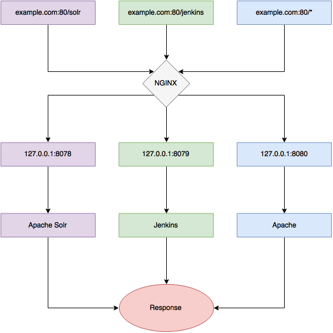

Remote **CIKit** host is Nginx based web server which protects web-traffic using basic HTTP authentication. Credentials for it can be configured in different ways: using `.cikit/environment.yml`, passing `--http-auth-user=admin --http-auth-pass=password` options to `cikit` utility or leaving everything as is, and get password generated in `.cikit/credentials/MATRIX_NAME/DROPLET_NAME/http_auth_pass` file.

## IP whitelist

You can set the list of IP addresses which will be whitelisted for skipping authentication. Use `.cikit/environment.yml` for this.

```yml
allowed_ips:
  # Localhost must be without authentication to 
  # run Behat tests.
  - 127.0.0.1

# Configure credentials here, but make sure they 
# won't be publicly available.
http_auth_user: admin
http_auth_pass: password
```

Authentication applies to Jenkins, Solr, builds - to each resource accessible from the web.

## Proxy structure

The next scheme demonstrates the structure of **CIKit** based server.



HTTPS traffic proxying on 443 port works the same.

Everything is simple in case of **Solr** and **Jenkins**. Here is an answer for question "**what is Apache for?**".

Historically Apache is older than Nginx and all supported by **CIKit** CMFs are working with it out of the box without additional configuration. Also each project could have its own `.htaccess` to influence server configuration.
