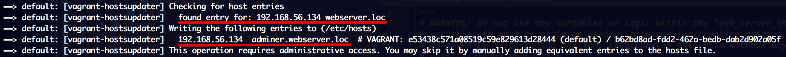
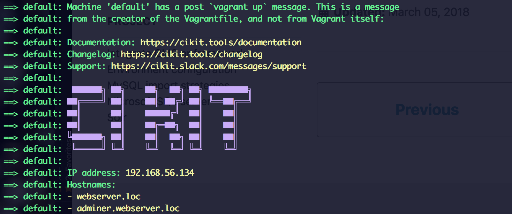

With zero-configuration CIKit creates you a single virtual host that serves an application within the `docroot` at `https://PROJECT.loc`. It may happen that you'll need sub-applications of the main one that located in separate directories and can be accessed on sub-domains.

## Create a configuration

Open `/path/to/project/.cikit/vars/web-server.yml` and find the `web_server_vhosts` variable inside. By default it's empty (has `[]` value). Add the `- dir: dirname` to the list where `dirname` is the name of a directory that must be at the same level as `docroot`. Put your codebase in that directory and enjoy.

### Simple example

As much as needed extra virtual hosts can be added in a similar way.

```yaml
web_server_vhosts:
  - dir: dirname
```

### Real-life example

For instance, you may consider having [Adminer](https://www.adminer.org) database manager.

- Add the virtual host.

  ```yaml
  web_server_vhosts:
    - dir: adminer
  ```

- Download the script.

  ```bash
  vagrant ssh
  mkdir /var/www/adminer
  wget https://github.com/vrana/adminer/releases/download/v4.6.2/adminer-4.6.2.php -O $_/index.php
  ```

- Provision a VM.

  ```bash
  CIKIT_TAGS="web-server" vagrant provision
  ```

  At the beginning of provisioning, Vagrant hosts manager will add needed entries to your "hosts" file so you can start using a subdomain right after completion.

  

- Visit an application at `https://adminer.PROJECT.loc`.

  `vagrant up` will also inform you about available hosts within the project.

  

## Questions

### Can I use subdomains on CI droplet?

Yes, you can! Let's consider `cikit88.example.com` as URL of a droplet, `my-project` as the name of a project and `adminer` as a subdomain.

- `my_project_build_19.cikit88.example.com` or `my_project_demo.cikit88.example.com` and similar will pass the request to an application within the `docroot`.
- `adminer.my_project_build_19.cikit88.example.com` or `adminer.my_project_demo.cikit88.example.com` and similar will pass the request to an application within the `adminer`.

### Is it works both for Nginx and Apache2?

Yes. Doesn't matter which [web-server](../web-server) you are using.
