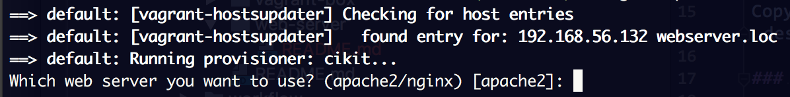
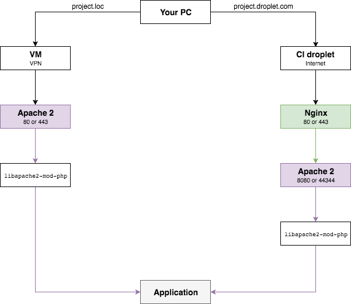
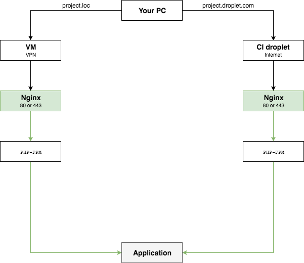

Choose the `apache2` or `nginx` as a web server for serving an application.

## Select web server for a project

Let's review the usual workflow of booting a project.

```bash
cikit init --project=webserver
cd webserver
vagrant up
```

On the provisioning step you'll be prompted to choose a web server:



The `apache2` is preselected by default since it was in CIKit from the beginning. Just hit `enter` to continue or type `nginx`.

When VM creation will be finished the time to create a CI droplet is come.

```bash
cikit matrix/droplet --limit=HOSTNAME --droplet-add
cikit provision --limit=HOSTNAME.DROPLET
```

That way you'll get a chosen web server on CI droplet automatically.

### Change web server on demand

**Warning!** A project, VM for which was created to serve the application using one of the web servers, cannot be hosted on CI droplet that was provisioned for another web server.
{: .notice--warning}

You’re able to discard the idea of using a chosen web server in favor of another one. Do so for existing VM:

```bash
CIKIT_TAGS="web-server" vagrant provision
```

Type the name when you'll be prompted and go. **Remember**, that right after the action is done the web server inside of VM will be changed and this won't affect the droplet where a project is hosted. If you are okay having different web servers locally and on a droplet - do nothing, otherwise remove a project from an existing droplet and add it to the one with an appropriate web server or create a new droplet and provision it from scratch.

## Modify project virtual hosts

Open the [/path/to/project/.cikit/vars/web-server.yml](https://github.com/BR0kEN-/cikit/blob/master/cmf/all/.cikit/vars/web-server.yml) and modify it as needed. Bear in mind, the logic within variables must remain unchanged.

## Override virtual hosts template

CIKit is distributed with general templates for creating virtual hosts for every supported web server and gives projects the possibility to overwrite them.

### Apache 2

Copy the default [vhosts.conf.j2](https://github.com/BR0kEN-/cikit/blob/master/scripts/roles/cikit-apache2/templates/vhosts.conf.j2) to the `/path/to/project/.cikit/templates/apache2`, modify it by desire and run the provisioning.

### Nginx

Copy the default [vhosts.conf.j2](https://github.com/BR0kEN-/cikit/blob/master/scripts/roles/cikit-nginx/templates/vhosts.conf.j2) to the `/path/to/project/.cikit/templates/nginx`, modify it by desire and run the provisioning.

## Technical details

There is a difference for operability in VM and on CI droplet: `nginx` is not needed in VM unless was chosen, as well as `apache2` is unneeded on CI droplet unless was chosen. 

### Apache 2

- Opening an application **locally** a request goes to VM thru VPN and handled by `apache2` with `libapache2-mod-php`.
- A request to **CI droplet** goes thru internet, handled by `nginx` that proxies it to `apache2` with `libapache2-mod-php`.



Why can't we exclude `nginx` from a chain on CI droplet in a case if `apache2` is chosen? Well, `nginx` is not only proxying a request to `apache2` but serves the other tools like Jenkins, Solr and provides the general [basic HTTP authentication for services and builds](../../matrix/droplet-http-auth/#proxy-structure).
{: .notice--info}

### Nginx

- Opening an application **locally** a request goes to VM thru VPN and handled by `nginx` that pass it to `php-fpm` FastCGI.
- A request to **CI droplet** goes thru internet, handled by `nginx` that pass it to `php-fpm` FastCGI.


