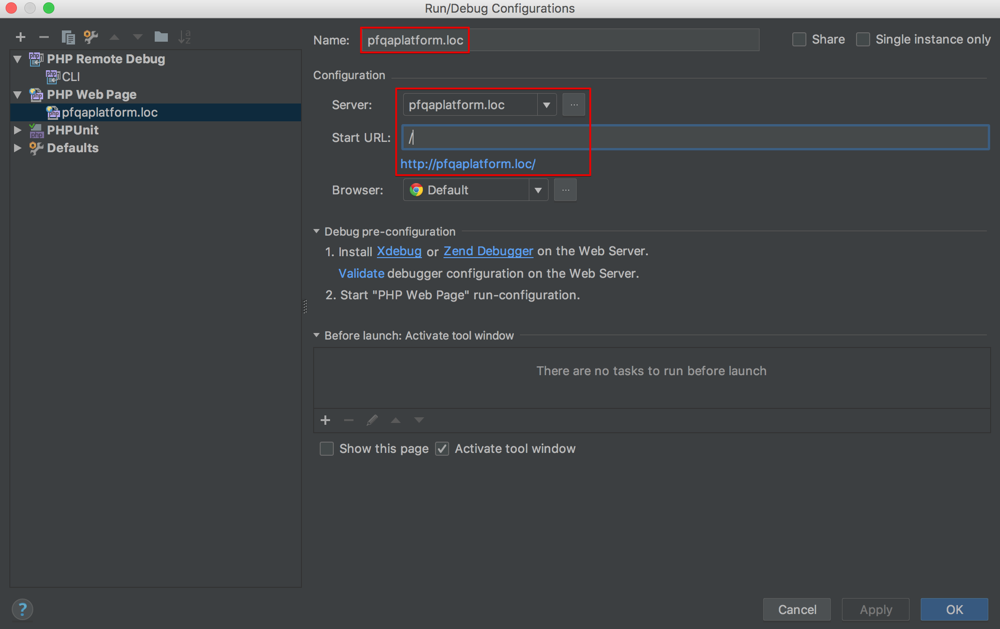

After provisioning the environment will have the `XDEBUG_CONFIG="idekey=PHPSTORM"` and `PHP_IDE_CONFIG="serverName=PROJECT_HOSTNAME"` variables set in `/etc/environment`.

The `PHPSTORM` can be changed in the [configuration](https://github.com/BR0kEN-/cikit/blob/master/scripts/roles/cikit-php/defaults/main.yml#L33).
{: .notice--info}

The `PROJECT_HOSTNAME` will be equal to the result returned by `hostname -f`.
{: .notice--info}

Therefore, you're in a couple of steps of completing the setup.

## Configure PhpStorm

The "dump" of environment for PHP 7.1 will look similar to the screenshot.

Consider `pfqaplatform` as the name of a project and `pfqaplatform.loc` as its hostname.
{: .notice--warning}

### Configure server

The name of a server must be equal to the `serverName=` that is stored in `PHP_IDE_CONFIG` environment variable.

### Configure for WEB

The name of a configuration could be arbitrary.

### Configure for CLI

The value of `IDE key(session id)` must be equal to the `idekey=` that is stored in `XDEBUG_CONFIG` environment variable.

All done, use the configuration.

