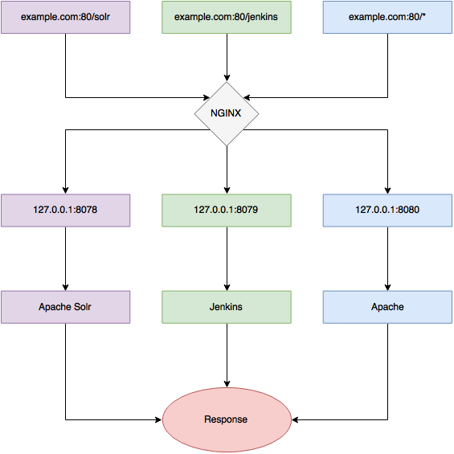

# Basic HTTP authentication

Remote **CIKit** host - is Nginx based web server which protect all web-traffic by basic HTTP authentication. You will [set the credentials for it during server provisioning](../../scripts/provision.yml#L39-L55).

Besides you can set the list of IP addresses which will be whitelisted for omitting authentication. [Add IPs here](../../scripts/vars/ip.yml) before setup the server.

Authentication spreads on Jenkins, Solr, builds - on each resource, accessible from the web.

## Proxy structure

The next scheme demonstrates the structure of **CIKit** based server.

Proxying of HTTPS traffic on 443 port works the same.

Everything is simple in case of **Solr** and **Jenkins**. Here is the answer on question "**for what Apache is needed?**".

Historically Apache is older than Nginx and all supported by **CIKit** CMFs are working with it out of the box without additional configuration. Also, each project could have own `.htaccess` for affecting on server configuration.
