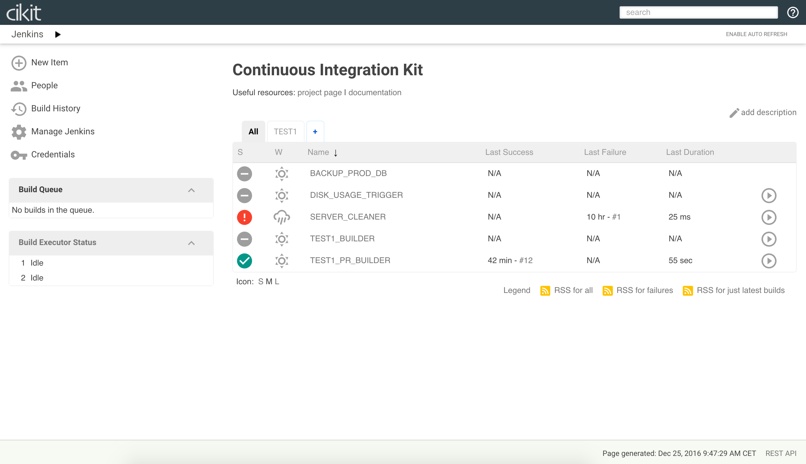
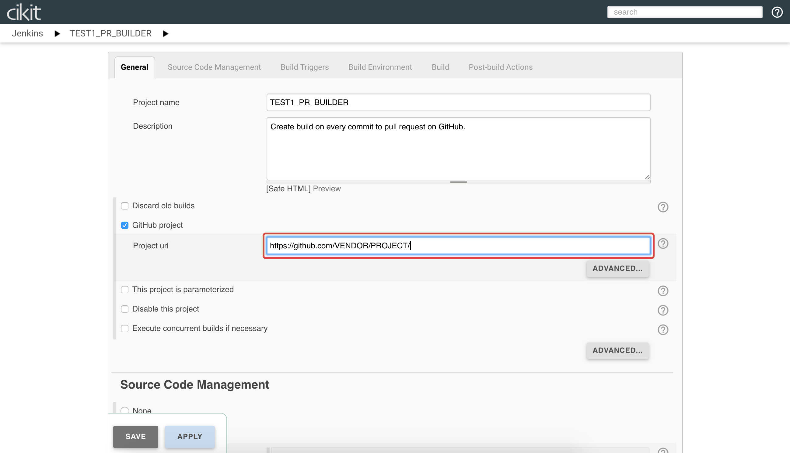
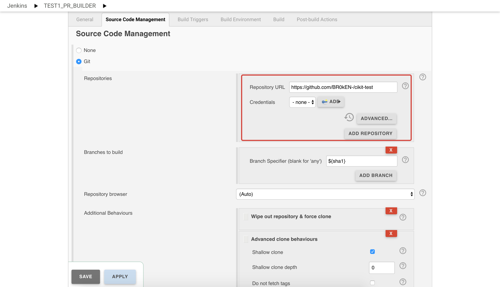
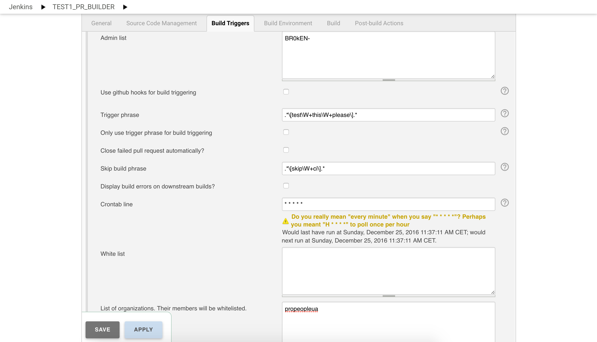

# Jenkins

After building of the remote server you'll have the Jenkins CI installed on `https://YOUR.DOMAIN/jenkins`. It's configured in a way that everyone, who have an access to that URL, - is an administrator. Protection achieved by setting [basic HTTP authentication](../basic-http-auth) for the whole domain using [Nginx](#nginx).

Here's the view of Jenkins home screen:



Every CI server can host as much as needed project. By default, when you've finished with setting it up, Jenkins will contain two project-related jobs: `<PROJECT>_BUILDER` and `<PROJECT>_PR_BUILDER` (`TEST1_BUILDER` and `TEST1_PR_BUILDER` on the screenshot above). Refer the next code snippet to add new project to existing server:

```shell
./cikit jenkins-job --project=test2 --limit=<SERVER_NAME_FROM_INVENTORY>
```

- What is [SERVER_NAME_FROM_INVENTORY](../ansible-inventory)?

In addition to the project's jobs there are exists some additional:

- `BACKUP_PROD_DB` - for creating snapshots of your production database (disabled by default and should be manually configured).
- `DISK_USAGE_TRIGGER` - periodically running job (every 10 minutes by default) for checking available free space on server's hard drive (can trigger `SERVER_CLEANER` if free space less than 5%).
- `SERVER_CLEANER` - periodically running job (every 24 hours by default) for removing all builds (files and databases).

## Configuring project jobs

Currently **CIKit** works with GitHub only. To make builds of the project you should host its codebase on GitHub and do couple manual actions to configure the job:

- Set the web URL of a project. 
- Set the repository URL of a project and configure an access for Jenkins (not be needed if project is public). 

Also, don't ignore advanced configuration of `GitHub Pull Request Builder`. There's you able to set the list of administrators (GitHub accounts), users allowed to control CI process via comments on Github, triggering phrases, etc.



Some explanations of the configurations on the image above:

- **Admin list** - GitHub users which can accept/decline participation of other users.
- **Trigger phrase** - finding this text in a comment to pull request will trigger new build.
- **Skip build phrase** - adding this phrase to title or body of pull request will not trigger a build.
- **White list** - list of GitHub users, which are allowed to participate in a project.
- **List of organizations** - the same as white list, but less text. Specify GitHub organization and all its members will be participants.

## Remarks

### Nginx

Nginx - is a global web server. It serving all connections and proxies requests to Jenkins, Solr and Apache. All requests are secured by [basic HTTP authentication](../basic-http-auth) you've configured during installation the CIKit.

## Technical notes

For setup the Jenkins was designed the [cikit-jenkins](../../scripts/roles/cikit-jenkins) Ansible role. All related information located there and here is just the list of useful references to it:

- [Jenkins version](../../scripts/roles/cikit-jenkins/vars/main.yml#L5)
- [List of plugins](../../scripts/roles/cikit-jenkins/defaults/main.yml#L29)
