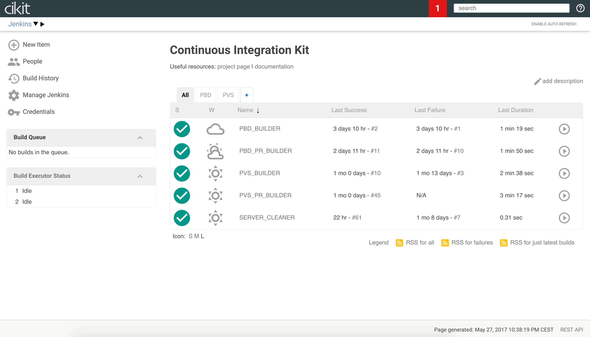

# Jenkins

Once remote server is built you will have **Jenkins** installed on `https://YOUR.DOMAIN/jenkins`. It's configured in a way that each anonymous user is an administrator. Protection achieved by setting [basic HTTP authentication](../basic-http-auth) for the whole domain using [Nginx](#nginx).

Here's the main view of Jenkins home screen:



Each CI server can host as much as needed projects. Every project on Jenkins is presented by two jobs: `<PROJECT>_BUILDER` and `<PROJECT>_PR_BUILDER`. Refer to the next code snippet to create new project on existing server:

```shell
cikit jenkins-job --project=test2 --limit=<HOSTNAME>
```

- What is the [HOSTNAME](../hosts-manager)?

Some additional jobs are supplied out of the box:

- `SERVER_CLEANER` - periodically running job (every 24 hours by default) for removing all builds (files and databases). Also, after every build it triggers to check whether server is needed to be cleaned up.

## Configuring bot

Bot will manage pull requests statuses, will react on triggering phrases in comments and publish reports. So we need to [set it up](github-bot)!

## Configuring project jobs

Currently **CIKit** works with GitHub only. For making project builds you have to host codebase on GitHub and implement several steps to configure the job:

- Set the web URL of a project. 
- Set the repository URL of a project and configure an access for Jenkins (not needed if project is public). 

Besides, don't ignore advanced configuration of `GitHub Pull Request Builder`. Here you able to edit the list of administrators (GitHub accounts), users allowed to control CI process via comments on Github, phrases-triggers etc.


Some configurations explanations on the image above:

- **Admin list** - GitHub users which can accept/decline other users participation.
- **Trigger phrase** - finding this text in a comment to pull request will trigger new build.
- **Skip build phrase** - adding this phrase to the pull reguest title or body will not trigger a build.
- **White list** - list of GitHub users which are allowed to participate in a project.
- **List of organizations** - the same as the white list, but there is less text. Specify GitHub organization and all its members will become participants.

## Remarks

### Nginx

Nginx is a global web server. It serves all connections and proxies requests to Jenkins, Solr and Apache. All requests are secured by [basic HTTP authentication](../basic-http-auth) that you've configured during installation the CIKit.

## Technical notes

The [cikit-jenkins](../../scripts/roles/cikit-jenkins) Ansible role was designed for Jenkins installation. There are all related information:

- [Jenkins version](../../scripts/roles/cikit-jenkins/vars/main.yml#L5)
- [List of plugins](../../scripts/roles/cikit-jenkins/defaults/main.yml#L29)
