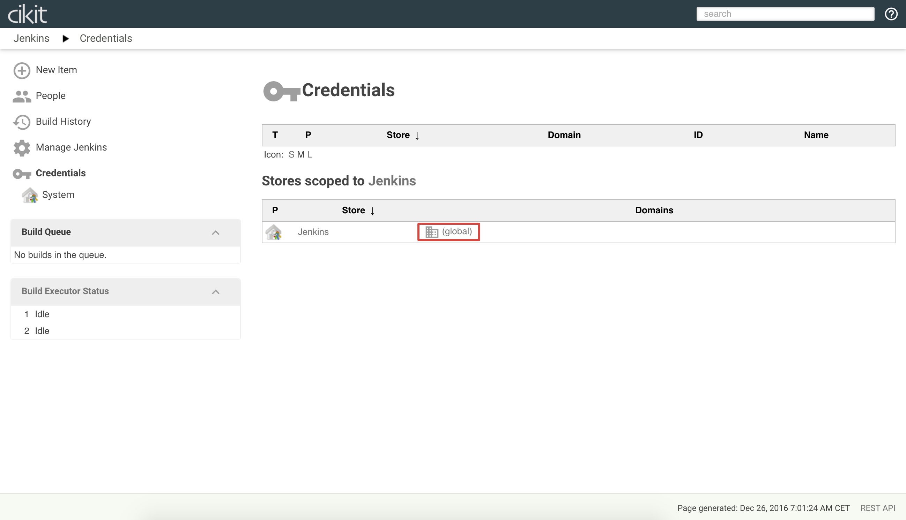
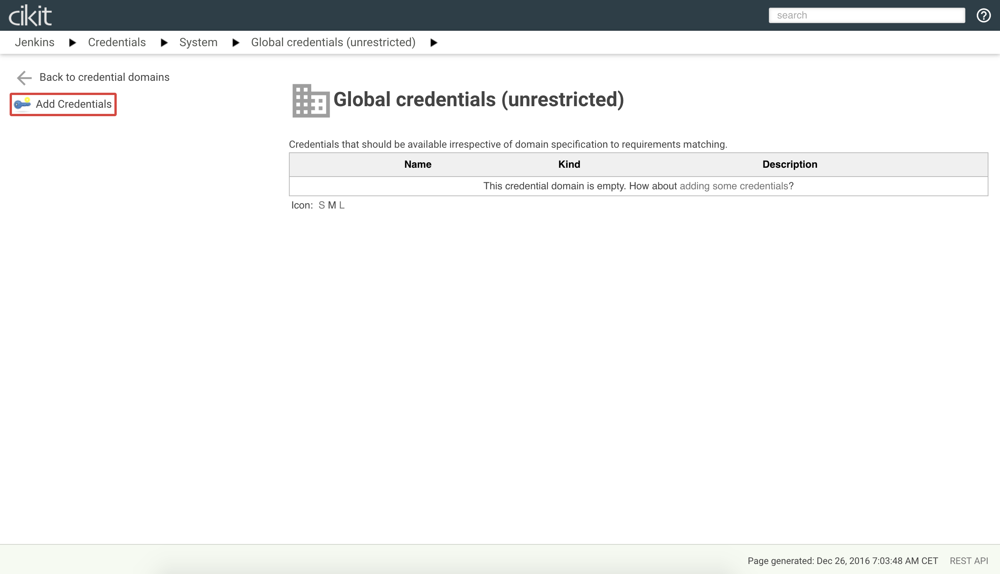
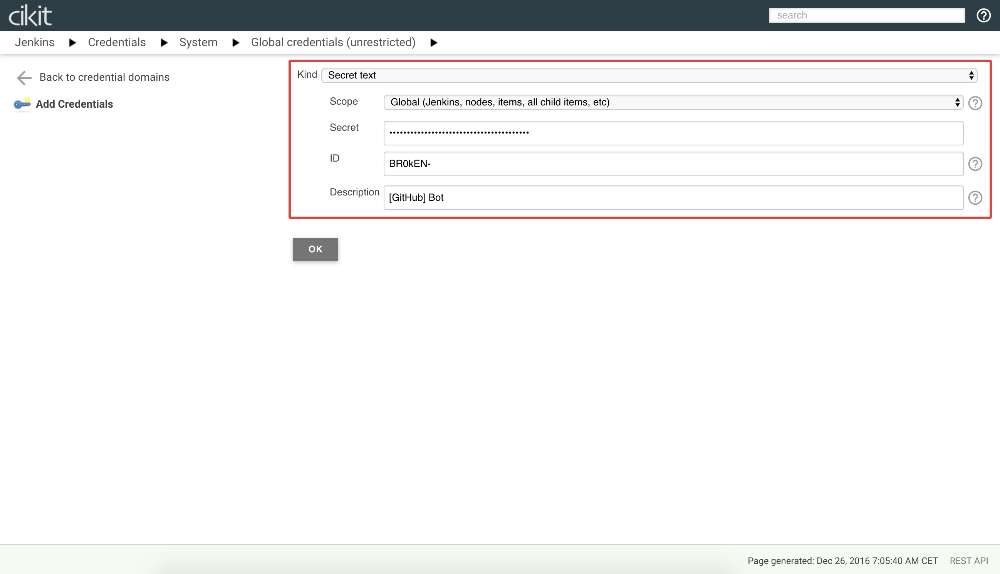
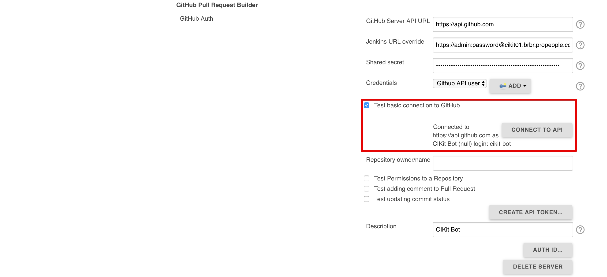

# GitHub Bot configuration

We have a hosting for code in face of **GitHub** and continuous integration server -  **Jenkins**. Two unlinked chain items. To setup the connection between them we should tune CI server and below located "step-by-step" tutorial for achieving this.

- Start with creating credentials entry. Visit `https://YOUR.DOMAIN/jenkins/credentials` or click on `Credentials` in sidebar. Initially we have only one credential domain named `Jenkins`. Click on `(global)` to proceed to the entries listing in the scope. 
- After passing to the domain credentials list we'll see the empty list and `Add Credentials` item in a sidebar. Click on it. 
- In just opened form we will use `Secret text` as value for `Kind`, `Scope` remains unchanged. `ID` is the account name on GitHub. `Secret` - personal access token for that account. `Description` - free editable value for identifying the entry among the others. Fill the values, press `OK` and configuration will be saved. 

## Have questions?

Now we overcame the first frontier. Let's review some questions you might have before continue.

### Do I need to use my own GitHub account?

Actually you do, but would be better to create another one with a name, such as `CIKit Bot` or similar, and use it only for CI purposes.

### Where should I get an access token for filling the `Secret` field?

Visit the settings screen on GitHub account you want to use as bot and find the `Personal access tokens` section in sidebar there (or just visit https://github.com/settings/tokens). If you already have some - choose one with `repo` permission. Create a new one if the list is empty or no one has `repo` permission.

## Testing operability

Okay, we've set up the account and ready to go with it. Now go to `GitHub Pull Request Builder` section of Jenkins configuration (`https://YOUR.DOMAIN/jenkins/configure`). Click on `TEST CREDENTIALS...`, check the `Test basic connection to GitHub` and press `CONNECT TO API` button. 

If the test is passed - you'll see the appropriate message. In case of failure you have to check the internet connection or GitHub account credentials correctness.

Also you can rename the connection for better identifying it among the others if you are planning to setup additional parts. Do that by changing the `Description` value field that is on the image above.

## Have questions?

Some points you might be interested in.

### How to work with private repositories?

Our bot must be added as a collaborator to a repository. In case of organization account it can be added as its member (to not repeat the action for each repository).

Once you decide that you've finished configuration on GitHub you can test an access to repository by checking `Test Permissions to a Repository`, typing its name and pressing `CHECK REPO PERMISSIONS` as you may see on the last screenshot.
