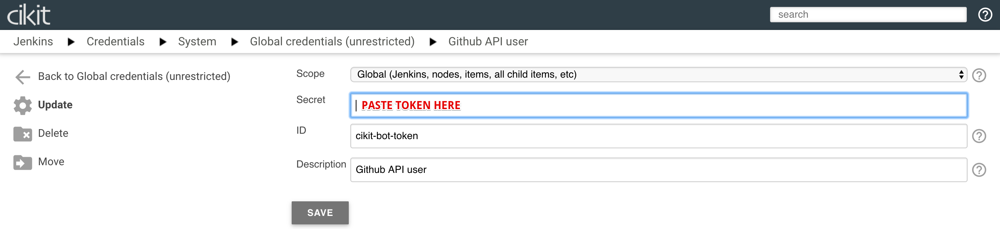
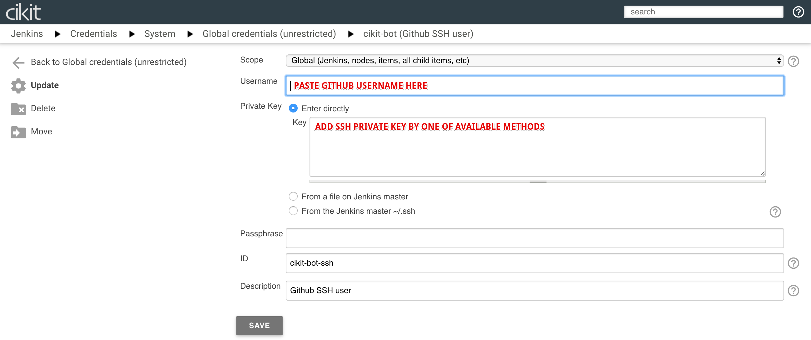

# GitHub Bot configuration

We have a hosting for code in face of **GitHub** and continuous integration server -  **Jenkins**. Two unlinked chain items. To setup the connection between them we should tune CI server and below is located a "step-by-step" tutorial for achieving this.

- Visit `https://YOUR.DOMAIN/jenkins/credentials` or click on `Credentials` in sidebar. Initially we have two types of credentials which must be modified one by one. 
- Click on `Github API user` / and `Update` at sidebar on opened page or proceed to `https://YOUR.DOMAIN/jenkins/credentials/store/system/domain/_/credential/cikit-bot-token/update`.  Put an API token of Github account into field, marked on screenshot.
- Proceed to editing of next credential (`Github SSH user`). Actions are the same as for previous one, or just open the `https://YOUR.DOMAIN/jenkins/credentials/store/system/domain/_/credential/cikit-bot-ssh/update`.  Use Github account where token you took from. Add public SSH key in settings of that account (on Github) and configure private key by one of available methods you may see on screenshot above.

## Have questions?

Now we overcame the first frontier. Let's review some questions you might have before continue.

### Do I need to use my own GitHub account?

Actually you can, but would be better to create another one with a name, such as `CIKit Bot` or similar, and use it only for CI purposes. Mandatory requirement - user must have **administrative privileges**. If repository is user-owned, then bot is not variant, because this kind of repositories can have only one admin - it's owner. Organization-owned repositories could have collaborators with configurable permissions level.

### Where should I get an access token for filling the `Secret` field?

Visit the settings screen on GitHub account you want to use as bot and find the `Personal access tokens` section in sidebar there (or just visit https://github.com/settings/tokens). If you already have some - choose one with `repo` permission. Create a new one if the list is empty or no one has `repo` permission.

## Testing operability

Okay, we've set up the account and ready to go with it. Now go to `GitHub Pull Request Builder` section of Jenkins configuration (`https://YOUR.DOMAIN/jenkins/configure`). Click on `TEST CREDENTIALS...`, check the `Test basic connection to GitHub` and press `CONNECT TO API` button. 

If the test is passed - you'll see the appropriate message. In case of failure you have to check the internet connection or GitHub account credentials correctness.

## Have questions?

Some points you might be interested in.

### How to work with private repositories?

Our bot must be added as collaborator to repository. In case of organization, it can be added as its member (to not repeat the action for each repository).

Once you decide that you've finished configuration on GitHub you can test an access to repository by checking `Test Permissions to a Repository`, typing its name and pressing `CHECK REPO PERMISSIONS` as you may see on the last screenshot.
