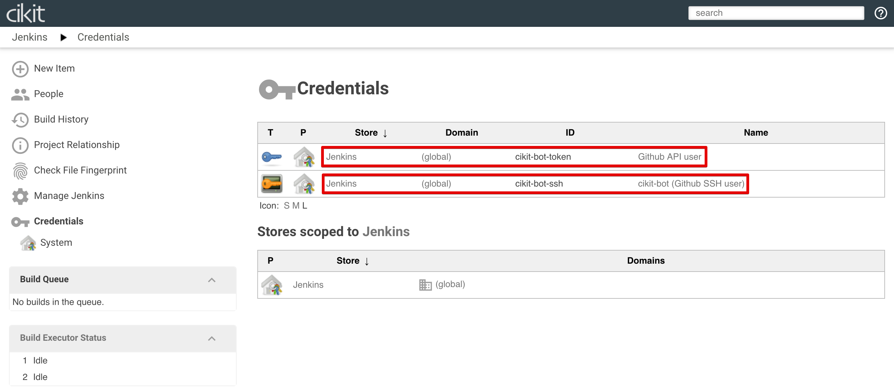

# GitHub Bot

We have a hosting for code in face of **GitHub** and continuous integration server -  **Jenkins**. Two unlinked chain items. To setup the connection between them we should tune CI server and below located a "step-by-step" tutorial for achieving this.

- Start by creating credentials entry. Visit `https://YOUR.DOMAIN/jenkins/credentials` or click on `Credentials` in sidebar. Initially we have only one credentials domain named `Jenkins`. Click on `(global)` to proceed to the listing of entries in that scope. 
- After passing to the domain credentials list we'll see the empty list and `Add Credentials` item in sidebar. Do a click on it. 
- In just opened form we will use `Secret text` as value for `Kind`, `Scope` remains unchanged. `ID` - it's the name of account on GitHub. `Secret` - personal access token of that account. `Description` - free editable value for identifying the entry among others. Fill the values, press on `OK` and configuration will be saved. 

## Have questions?

Now we overcame the first frontier. Let's review some questions you might have before continue.

### Do I need to use my own GitHub account?

Actually you can, but would be better to create another one with name, such as `CIKit Bot` or similar and use it only for CI purposes.

### Where I should take an access token for filling the `Secret` field?

Visit the settings screen of GitHub account you want to use as bot and find the `Personal access tokens` section in sidebar there (or just visit https://github.com/settings/tokens). If you already have some - chose one with `repo` permission. Create a new if list is empty or no one had `repo` permission.

## Checking workability

Okay, we did setting up the account and ready to go with it. Now go to `GitHub Pull Request Builder` section of Jenkins configuration (`https://YOUR.DOMAIN/jenkins/configure`). Click on `TEST CREDENTIALS...`, check the `Test basic connection to GitHub` box and press on `CONNECT TO API` button. 

If test passed - you'll see the appropriate message. In case of failure you have to check the internet connection or validity of GitHub account credentials.

Also, you can rename the connection for better identifying it among others if you are planning to setup complementary. Do this by changing the value of `Description` field which is seeing on image above.
