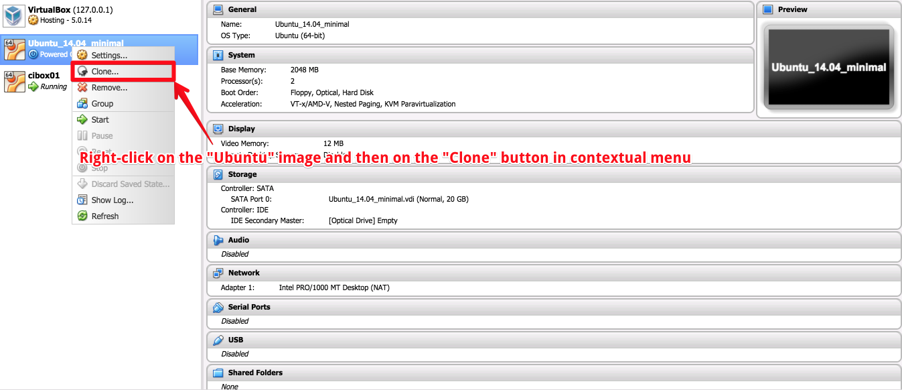
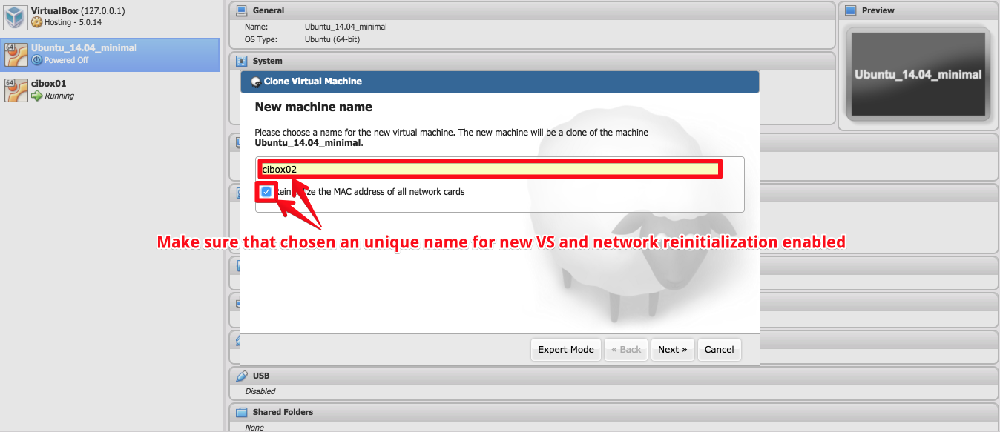
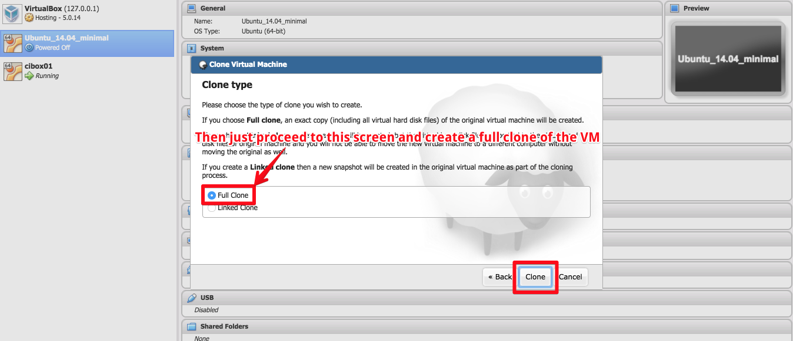
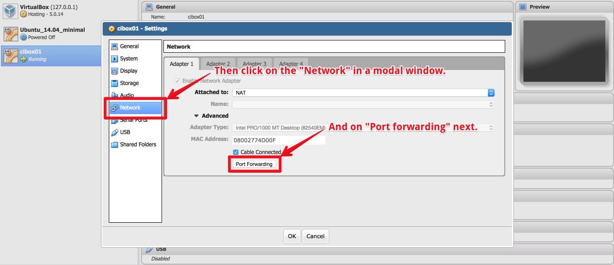
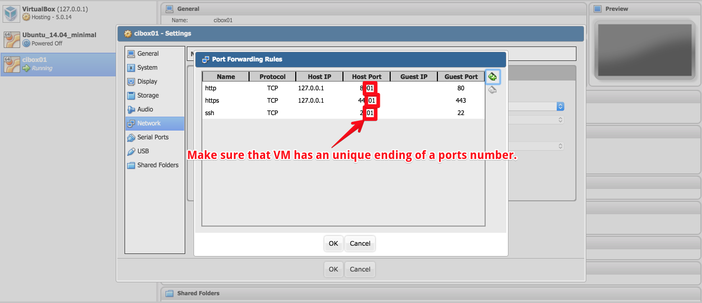
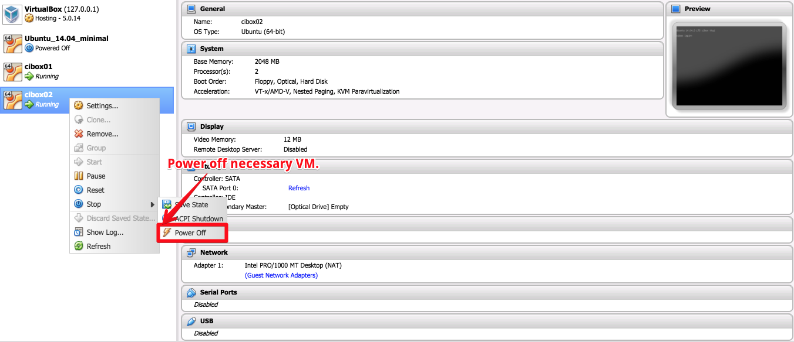
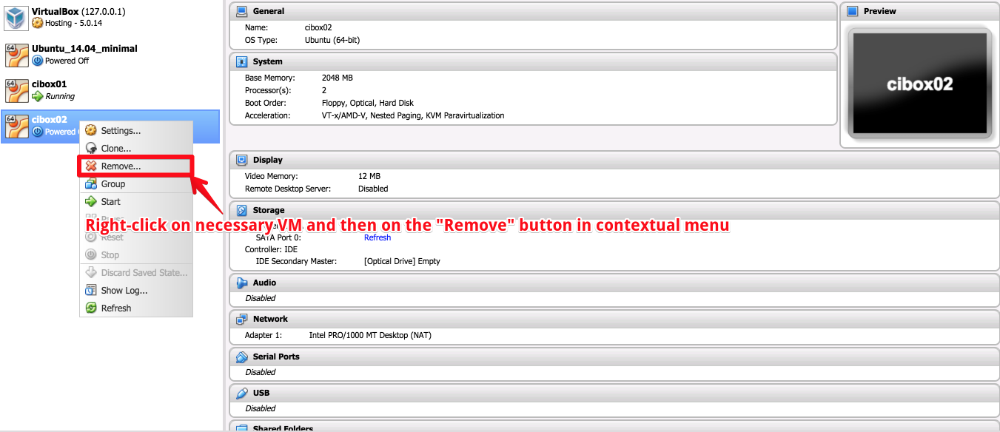
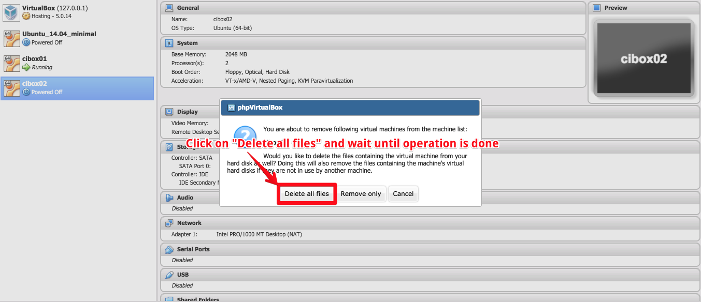

# Droplets management using UI

Control virtual machines on physical server using `PHP Virtual Box`.

## List of droplets

Visit your host, login and see the list of all droplets.

## Create new droplet

When described above steps are done, then just power on a virtual machine, create new record at [inventory](/inventory#L7-L8) and provision new virtual server with main `cikit` tool.

`phpVirtualBox` will be available on the domain/IP of your [host](../host). Imagine that it is: `m2.propeople.com.ua`. As you can see on the screenshots, every port ends by `01`. This means that domain for VM will be `cikit01.propeople.com.ua`.

Why `cikit<NN>`? Check out this [variable](../../../matrix/matrix.yml#L7) for the answer.

## Delete droplet

