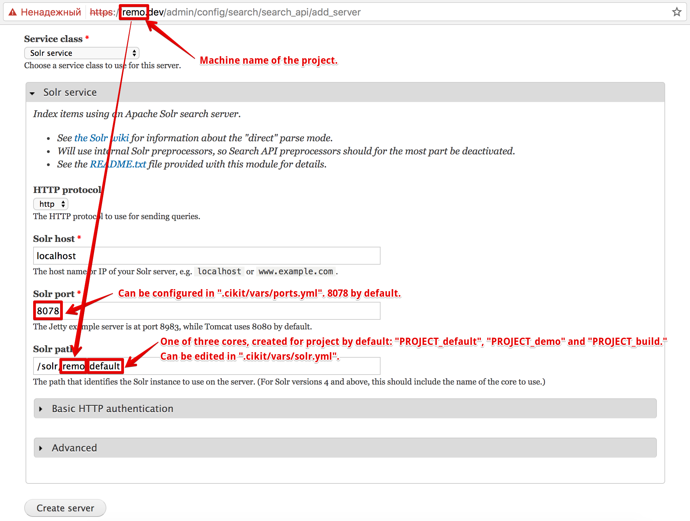

# Solr

Be aware that Solr - is not a regular service which can be used thru `System V` initialization scripts (like `sudo service solr restart`).

By default it's configured to be operable by its own user - `solr` - with home directory at `/opt/solr`. Data directory with schema, cores and another configurations located at `/var/solr`.

## Usage

Execute `sudo runuser -l solr -c "solr"` to see the list of available operations.

### Common examples

Check the status, stop, start and/or restart server.

```shell
sudo runuser -l solr -c "solr [status|stop|start|restart]"
```

### Warning

You may simplify the entire command to execute to `sudo solr` and suppress warning using `-force` option but it's definitely not recommended to run search server that way.

### UI

- Local UI, inside of VM, is available on: `http://PROJECT.dev:8078`
- Remote UI, on CI server, is available on: `https://DOMAIN/solr`


### Drupal configuration

```shell
./cikit repository --cmf=drupal --version=7.54 --project=remo
cd remo
vagrant up
vagrant ssh
cikit reinstall
drush en search_api_solr -r /var/www/docroot -y
```


