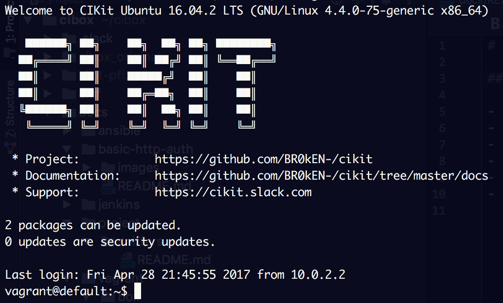

# Vagrant Box

## Creation process

- Create virtual machine with name `CIKit Ubuntu 16.04 LTS`, disabled audio and USB
- Install Ubuntu, downloaded from https://www.ubuntu.com/download/server
- Set password for `root` and `vagrant` users to [vagrant](../../../scripts/tasks/setup.yml#L16)
- Allow `root` user to be logged in via password (set `PermitRootLogin` to `yes` in `/etc/ssh/sshd_config`). It is important since this image will be also used for remote servers and, for very first connection, server must be "public". Once you run provisioning, [`vagrant` user will be removed](../../../scripts/tasks/bootstrap-remote.yml#L53) and [`root` will be prohibited to be logged in using password](../../../scripts/tasks/bootstrap-remote.yml#L61).
- Permit `vagrant` user to run `sudo` without password (`/etc/sudoers.d/vagrant`)
- Add [official public key of Vagrant](https://github.com/mitchellh/vagrant/tree/master/keys) to `/home/vagrant/.ssh/authorized_keys`
- Install OpenSSH
- Install VirtualBox Guest Additions

Nice, detailed instruction available here: https://blog.engineyard.com/2014/building-a-vagrant-box

