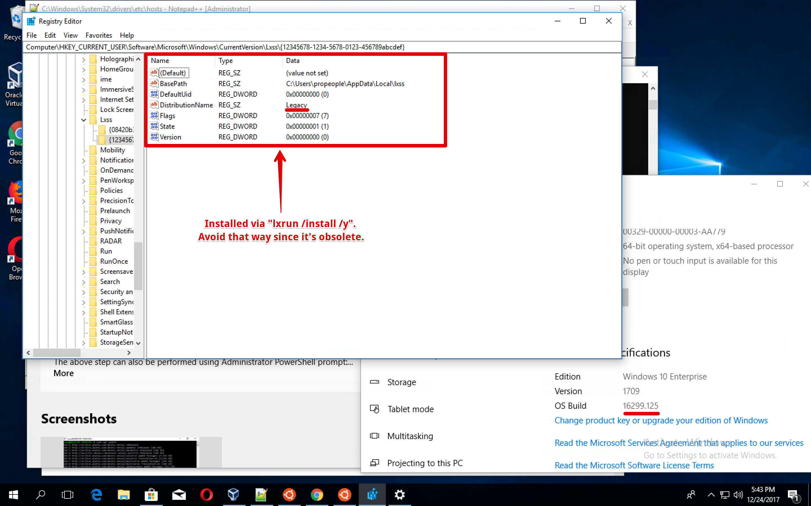
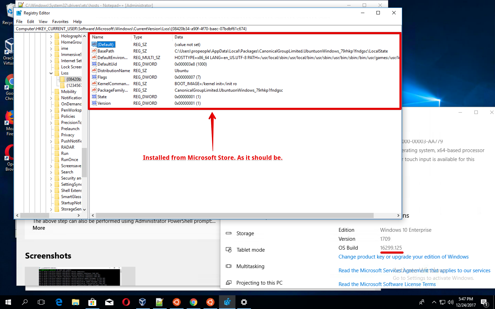
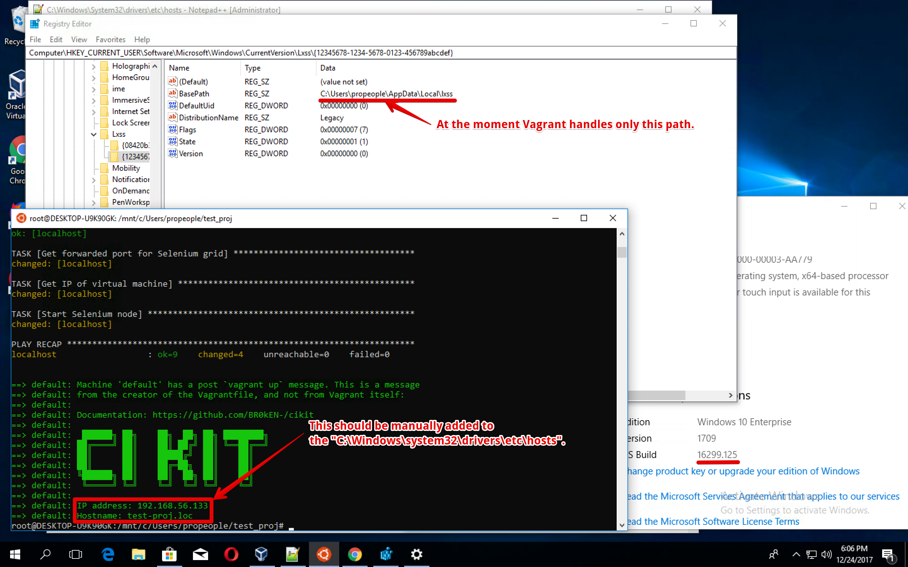

# Installation within Windows Linux Subsystem

- Ensure OS build number is greater than [14951](https://docs.microsoft.com/ru-ru/windows/wsl/release-notes#build-14951) (run `ver` in `cmd.exe` to check this). Refer the https://blogs.windows.com/windowsexperience/2016/10/19/announcing-windows-10-insider-preview-build-14951-for-mobile-and-pc official blog post and the https://blogs.msdn.microsoft.com/commandline/2016/10/19/interop-between-windows-and-bash explanation for more.

  Make sure your are not using Enterprise version of Windows since "Fall Creators Update" cannot be installed on that one easily (valuable only if your build is lower than required). More info at https://support.microsoft.com/en-us/help/3188105/-contact-your-system-administrator-to-upgrade-windows-server-or-enterp.

  Having a lower build number you won't be able to run the whole stack due to missing [WSL interoperability](https://docs.microsoft.com/en-us/windows/wsl/interop) and below operations will be redundant.

  *At the moment of writing these instructions, the Windows 10 of version `1709`, having the `16299.125` build, has been used for testing*.

- [Install a Windows Subsystem for Linux (WSL)](https://docs.microsoft.com/en-us/windows/wsl/install-win10). Remember, that **it is not recommended to use `lxrun` for installing WSL** if OS build number is `16215` or later.

  Imagine we have a *good enough* build. If so we can simplify this step by just running a PowerShell (should be in a privileged mode) one-line command (needs restart afterward).

  ```powershell
  Enable-WindowsOptionalFeature -Online -FeatureName Microsoft-Windows-Subsystem-Linux
  ```

  Check whether everything went smoothly (again, PowerShell ought to be started with administrative rights) after the system is boot again.

  ```powerhsell
  Get-WindowsOptionalFeature -Online -FeatureName Microsoft-Windows-Subsystem-Linux
  ```

  If you made sure all good, open the Microsoft Store and use search to find Ubuntu. Proceed to its page and click `Get`. After distro will be downloaded, click `Launch` and do the installation.

  **Not recommended, legacy installation via `lxrun`**.

  

  **Recommended installation from Microsoft Store**.

  

- Install [VirtualBox](https://www.virtualbox.org/wiki/Downloads) as a regular Windows program. Installation of Guest Additions isn't needed.

- Install Pip and Ansible inside of Ubuntu.

  ```bash
  sudo apt update
  sudo apt install python-setuptools -y
  sudo easy_install pip
  sudo pip install ansible
  ```

- Install Vagrant inside of Ubuntu (https://www.vagrantup.com/docs/other/wsl.html#vagrant-installation, https://github.com/Microsoft/WSL/issues/733#issuecomment-266175270). You might change the value of the `VAGRANT_VERSION` but it must not be lower than `1.9.5`.

  You don't need to have Vagrant as a Windows program. Do never use `vagrant.exe` in a case you already have it and don't want to remove.

  ```bash
  VAGRANT_VERSION="2.0.1"
  VAGRANT_FILENAME="vagrant_${VAGRANT_VERSION}_x86_64.deb"

  wget -q "https://releases.hashicorp.com/vagrant/${VAGRANT_VERSION}/${VAGRANT_FILENAME}"
  sudo dpkg -i "${VAGRANT_FILENAME}"
  rm "${VAGRANT_FILENAME}"
  ```

- Relying on Windows / WSL interoperability, cheat a WSL that `VBoxManage.exe` and `powershell.exe` are Linux binaries. This needed because Vagrant uses exactly that executables.

  ```bash
  sudo ln -s "/mnt/c/Program Files/Oracle/VirtualBox/VBoxManage.exe" /usr/bin/VBoxManage
  sudo ln -s "/mnt/c/Windows/System32/WindowsPowerShell/v1.0/powershell.exe" /usr/bin/powershell
  ```

- Run the following script if you don't have the `%LOCALAPPDATA%\lxss` directory (verify in the `cmd.exe` executing the `dir %LOCALAPPDATA%\lxss`). Check the https://github.com/berkshelf/vagrant-berkshelf/issues/323#issue-267607656 for more.

  In short, it'll be missing if you install WSL from Windows Store and not by running the `lxrun /install /y` from `cmd.exe`. And it must be missing because `lxrun` - is legacy way to install WSL. At the moment this is [the issue in Vagrant](https://github.com/hashicorp/vagrant/issues/9298) and later it should be resolved so this step won't be needed.

  Start PowerShell with administrative privileges executing this by pasting into the search bar.

  ```
  cmd /c powershell "Start-Process powershell -Verb runAs"
  ```

  Copy and run the PowerShell script.

  ```powershell
  $WSLREGKEY="HKCU:\Software\Microsoft\Windows\CurrentVersion\Lxss"
  $WSLDEFID=(Get-ItemProperty "$WSLREGKEY").DefaultDistribution
  $WSLFSPATH=(Get-ItemProperty "$WSLREGKEY\$WSLDEFID").BasePath
  New-Item -ItemType Junction -Path "$env:LOCALAPPDATA\lxss" -Value "$WSLFSPATH\rootfs"
  ```

  

- Allow Vagrant to use VirtualBox within WSL. It'll be easier for you to preserve this variable in `~/.profile`, for instance.

  ```bash
  # Without enabling this feature the ".vagrant.d" will be placed to
  # the "/mnt/c/Users/$USER/.vagrant.d". This will break SSH because
  # the private key will have too open permissions and you won't be
  # able to apply "chmod" for the file in Windows file system.
  export VAGRANT_WSL_DISABLE_VAGRANT_HOME=1
  export VAGRANT_WSL_ENABLE_WINDOWS_ACCESS=1
  ```

- **Do never place files, you're gonna edit, within WSL**. Locate them on `/mnt/` only. Modifying data in Linux subsystem by Windows tools will lead to **their corruption and loss**. The https://github.com/Microsoft/WSL/issues/1283#issuecomment-352183860 issue has some clarification on that.

- Install CIKit as usual, create a project and provision a VM. Remember that you'll be required to manage hostnames of your projects manually in the `%SYSTEMROOT%\system32\drivers\etc\hosts`. Windows system files are not modifiable from a WSL even if WSL is running in privileged mode. Moreover, do not run `Bash` with administrative privileges because VirtualBox won't operate properly.

## Limitations

This section list the explanations of limitations you'll have in WSL under Windows.

- You have to define IP aliases for hosts by yourself.
- You are not able to use NFS shares and forced to go with VBoxSF.
- Microsoft Edge ignores the modifications of `hosts` file and doesn't open websites.
