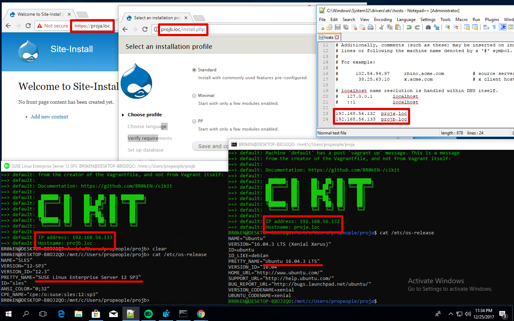

# Installation within Windows Linux Subsystem

## Ensure OS build is ready to go

Ensure OS build number is greater than [14951](https://docs.microsoft.com/ru-ru/windows/wsl/release-notes#build-14951) (run `ver` in `cmd.exe` to check this). Refer the https://blogs.windows.com/windowsexperience/2016/10/19/announcing-windows-10-insider-preview-build-14951-for-mobile-and-pc official blog post and the https://blogs.msdn.microsoft.com/commandline/2016/10/19/interop-between-windows-and-bash explanation for more.

Make sure your are not using Enterprise version of Windows since "Fall Creators Update" cannot be installed on that one easily (valuable only if your build is lower than required). More info at https://support.microsoft.com/en-us/help/3188105/-contact-your-system-administrator-to-upgrade-windows-server-or-enterp.

Having a lower build number you won't be able to run the whole stack due to missing [WSL interoperability](https://docs.microsoft.com/en-us/windows/wsl/interop) and below operations will be redundant.

*At the moment of writing these instructions, the Windows 10 of version `1709`, having the `16299.125` build, has been used for testing*.

## Install Windows Subsystem for Linux

Remember, that **it is not recommended to use `lxrun` for installing WSL** if OS build number is `16215` or later. Please, carefully read the https://docs.microsoft.com/en-us/windows/wsl/install-win10.

Imagine we have a *good enough* build. If so, we can simplify this step by just running a PowerShell one-line command (should be in a privileged mode and will require OS restart afterward).

```powershell
Enable-WindowsOptionalFeature -Online -FeatureName Microsoft-Windows-Subsystem-Linux
```

After the system is boot again, open the Microsoft Store and use search to find Ubuntu/openSUSE/another distro. Proceed to its page and click `Get`. After distro will be downloaded, click `Launch` and do the installation.

**Not recommended, legacy installation via `lxrun`**.


**Recommended installation from Microsoft Store**.


## Install VirtualBox

This is achievable without any inconvenience and extra steps. Just download VirtualBox at https://www.virtualbox.org/wiki/Downloads and install it as a regular Windows program.

Installation of Guest Additions is not needed.

## Install PIP and Ansible inside of WSL

Execute this script on **Ubuntu**.

```bash
sudo apt update
sudo apt install python-setuptools -y
```

Execute this script on **openSUSE**.

```bash
sudo zypper addrepo --check --refresh --name 'openSUSE-42.2-OSS' http://download.opensuse.org/distribution/leap/42.2/repo/oss/ oss
sudo zypper update
sudo zypper install python-setuptools -y
```

Execute this script on any distro.

```bash
sudo easy_install pip
sudo pip install ansible
```

## Install Vagrant inside of WSL

- You might change the value of the `VAGRANT_VERSION` but it must not be lower than `1.9.5`.
- You don't need to have Vagrant as a Windows program.
- Do never use `vagrant.exe` in a case you already have it and don't want to remove.

Execute this script on **Ubuntu**.

```bash
PACKAGE_EXT="deb"
PACKAGE_UTIL="dpkg"
```

Execute this script on **openSUSE**.

```bash
PACKAGE_EXT="rpm"
PACKAGE_UTIL="rpm"
```

Execute this script on any distro.

```bash
VAGRANT_VERSION="2.0.1"
VAGRANT_FILENAME="vagrant_${VAGRANT_VERSION}_x86_64.${PACKAGE_EXT}"

wget -q "https://releases.hashicorp.com/vagrant/${VAGRANT_VERSION}/${VAGRANT_FILENAME}"
sudo ${PACKAGE_UTIL} -i "${VAGRANT_FILENAME}"
rm "${VAGRANT_FILENAME}"
```

## Prepare Linux environment for Vagrant operation

Relying on WSL interoperability, [cheat WSL](https://github.com/Microsoft/WSL/issues/733#issuecomment-266175270) that `VBoxManage.exe` and `powershell.exe` are Linux binaries. This needed because Vagrant uses exactly that executables.

```bash
sudo ln -s "/mnt/c/Program Files/Oracle/VirtualBox/VBoxManage.exe" /usr/bin/VBoxManage
sudo ln -s "/mnt/c/Windows/System32/WindowsPowerShell/v1.0/powershell.exe" /usr/bin/powershell
```

Allow Vagrant to operate in WSL.

```bash
cat << 'HERE' > ~/.vagrant.profile
# Without enabling this feature the ".vagrant.d" will be placed to
# the "/mnt/c/Users/$USER/.vagrant.d". This will break SSH because
# the private key will have too open permissions and you won't be
# able to apply "chmod" for the file in Windows file system. Moreover,
# we are isolating Vagrant in WSL container and don't want to expose
# boxes and other info from outside of it.
export VAGRANT_WSL_DISABLE_VAGRANT_HOME=1
# Allow Vagrant to operate in WSL.
# https://www.vagrantup.com/docs/other/wsl.html#vagrant-installation
export VAGRANT_WSL_ENABLE_WINDOWS_ACCESS=1
HERE

echo "source ~/.vagrant.profile" >> ~/.profile
```

## Resolution of known problem (@todo)

Bear in mind that this step brings you an additional limitation, disallowing Vagrant to operate in multiple WSL instances (doubt someone needs this, but just FYI). The limitation is gone for sure when [the issue in Vagrant](https://github.com/hashicorp/vagrant/issues/9298) will be solved.

Run the following script if you don't have the `%LOCALAPPDATA%\lxss` directory (verify in the `cmd.exe` executing the `dir %LOCALAPPDATA%\lxss`). Check the https://github.com/berkshelf/vagrant-berkshelf/issues/323#issue-267607656 for more.

In short, it'll be missing if you install WSL from Windows Store and not by running the `lxrun /install /y` from `cmd.exe`. And it must be missing because `lxrun` - is legacy way to install WSL.

Copy and run the PowerShell script (in privileged mode).

```powershell
$WSLREGKEY="HKCU:\Software\Microsoft\Windows\CurrentVersion\Lxss"
$WSLDEFID=(Get-ItemProperty "$WSLREGKEY").DefaultDistribution
$WSLFSPATH=(Get-ItemProperty "$WSLREGKEY\$WSLDEFID").BasePath
New-Item -ItemType Junction -Path "$env:LOCALAPPDATA\lxss" -Value "$WSLFSPATH\rootfs"
```


## All ready

- **Do never place files, you're gonna edit, within WSL**. Locate them on `/mnt/` only. Modifying data in Linux subsystem by Windows tools will lead to **their corruption and loss**. The https://github.com/Microsoft/WSL/issues/1283#issuecomment-352183860 issue has some clarification on that.
- Install CIKit as usual, create a project and provision VM.

## Limitations

- You have to manage hostnames of your projects manually by editing the `%SYSTEMROOT%\system32\drivers\etc\hosts`. Windows system files are not modifiable from WSL even if it's running in privileged mode. Moreover, do not run WSL with administrative privileges because VirtualBox won't operate properly.
- You are not able to use NFS shares and forced to go with VBoxSF.
- Microsoft Edge ignores the modifications of `hosts` file and doesn't open websites (temporary, investigation on this is going forward).

## Result

As a proof, you may take a look at the screenshot which shows that single Windows instance might have many WSL containers running with the CIKit.



*For now it's possible only with the https://github.com/hashicorp/vagrant/pull/9300 patch applied. (@todo)*
