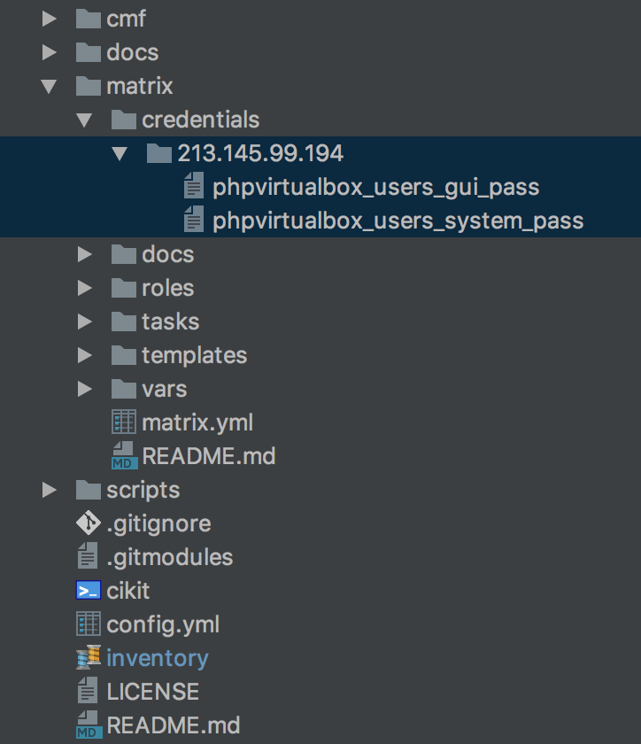

# Matrix

You are able to create your own matrix with virtual servers using this tool.

Let's describe both structure and technologies. First of all, we need to get acquainted with two basic terms: `host` and `droplet`.

- `host` - [physical computer (server)](../docs/matrix/host);
- `droplet` - virtual machine, located on the `host`.

As much droplets as needed can be created on a host machine (depending on hardware configuration, of course).

Host machine operates only with minimal set of software:

- VirtualBox
- NGINX
- PHP
- phpVirtualBox

Each droplet has its own private network, which is forwarded to a host. For example, you have 10 virtual servers. Each of them forwards to three ports: `80<NN>`, `443<NN>` and `22<NN>` (`<NN>` is a serial number of the droplet). NGINX is listening `80<NN>` and `443<NN>` ports in a host and forwards connection inside the droplets. `80<NN>` forwards to 80, `443<NN>` - to 443. `22<NN>` forwards to 22, for SSH connections.

That's all! And it's cool! Each virtual server may be additionally provisioned by main `cikit` tool to convert it to CI server.

## Before you begin

Remember that host machine must be publicly accessible via internet. Otherwise you will be required to manually configure forwarding to the following ports: `22<NN>`, `80<NN>` and `443<NN>` (where `<NN>` - is a serial number of VM).

Physical server must be provisioned with a superuser which has no-password access for `sudo` (e.g. `your_user ALL=(ALL) NOPASSWD:ALL` entry in `/etc/sudoers`). So, make sure the user is properly configured if you have set value for `ansible_user`, different from `root`, in your [inventory](../docs/ansible/inventory).

The recommendation is to run the provisioning using `root` user. But you may choose. Beside of that, please MAKE SURE you took care about security!

Recommended (will work as untrusted connection):

- [SSL certificates](vars/ssl.yml#L3). Use trusted certificates to provide secure connection.

Optional (passwords will be generated automatically if not set):

- [Name and password for user to run `VBoxWeb` service](vars/phpvirtualbox.yml#L10-L11). This user is permitted to connect via SSH.
- [Password for `admin` user for VirtualBox GUI](vars/phpvirtualbox.yml#L7-L8). CRUD operations for users and virtual machines.

**You can easily omit setting the passwords (especially if you can't invent secure ones).** In this case they'll be automatically generated, used and saved locally in `credentials/HOSTNAME/phpvirtualbox_users_system_pass` and `credentials/HOSTNAME/phpvirtualbox_users_gui_pass`. At any further reprovisioning they'll be looked up from those files, so you may not worry they changed.



Not recommended (general credentials - not good for each virtual machine):

- [Basic HTTP authentication](vars/nginx.yml#L4-L12). Not recommended to set it up for the whole server - better to do this for every particular virtual machine.

## Usage

Add your own host inside the `inventory` file and run the following command:

```shell
./cikit matrix/matrix.yml --limit=<HOSTNAME>
```

New droplets (VMs) will be based on an image, which is assumed as [base](vars/virtualmachine.yml#L13) for the matrix.

### Add trusted SSL certificate

Inside of the `/path/to/directory/` two files must be located: `*.crt` and `*.key`. They are will be copied and NGINX will start use them immediately.

```shell
./cikit matrix/matrix.yml --limit=<HOSTNAME> --tags=ssl --ssl-src=/path/to/directory/ --restart=nginx
```

## Management

You are able to choose two ways for managing your virtual machines: whether using [Ansible](docs/droplet/ANSIBLE.md) or [UI of PHP Virtual Box](docs/droplet/UI.md).

## To do

- [ ] Monitor the progress on https://github.com/imoore76/phpvirtualbox/issues/19 and remove hack of [phpvirtualbox](roles/phpvirtualbox) role
- [ ] Ability to add SSH keys to the droplet on creation phase
- [ ] Reuse roles from Matrix in CIKit (`nginx`, `ssl`)
- [x] Set hostname for each new droplet
